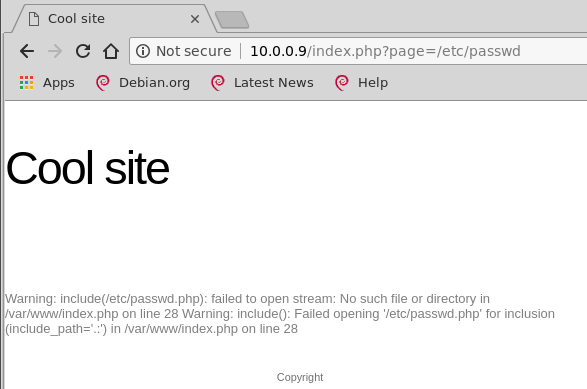

# Preparation

## Goal

* Kali Linux running as a virtual machine \(VM\) in either Virtualbox, Hyper-V or VMware Workstation/Player
* VM must be able to enter fullscreen mode
* Working coypaste of files and text between Kali and host operation system 
* Working VPN access to HTB
* Acquite some basic Linux terminal skills

### **1 Join the social channel**

There is a dedicated Hackthebox channel in the [Netsecfocus MM](https://mm.netsecfocus.com) with a lot of hackers eager to assist.

### **2 Install virtualization software**

You need to run Kali Linux as a virtual machine on your computer. There are a few software alternatives for working with virtual machines \(VMs\). You can use whatever host operating system you like as long as you feel comfortable installing the required software. The "host" operating system is the one installed on your laptop. The "guest" is the virtual machine operating system.

* [Virtualbox ](https://www.virtualbox.org/)- free
* [VMware Player](https://www.vmware.com/products/workstation-player.html) - free
* [VMware Workstation Pro](https://www.vmware.com/products/workstation-pro.html) - paid
* [Hyper-V](https://docs.microsoft.com/en-us/virtualization/hyper-v-on-windows/quick-start/enable-hyper-v) - preinstalled in Windows 10, but must be enabled. Linux support is not great, so this guide won't cover it as it relies on Kali Linux.

### **3 Install Kali Linux**

[Kali Linux](https://www.kali.org) is a Linux distribution maintained by Offensive Security. They provide pre-installed VMs you can import straight into your virtualization software and run instantly without having to install anything. If you chose to install it manually you are free to do so.

* [Download a Kali VM](https://www.offensive-security.com/kali-linux-vm-vmware-virtualbox-hyperv-image-download/) appropriate for your virtualization software of choice, see step 2. You want a 64-bit version, not x86.
* You do not need to create a new user in Kali. The root user is sufficient for this guide and will make installation work without using the `sudo` command that many are eager to try.

### **4 Make copypaste and fullscreen work**

Without copypaste between guest and host OS and fullscreen, hacking is gonna become a bit tiresome. So we highly recommend you get this working before you start. You need what's called guest additions to be able to do these things. We recommend using the packages available through the package manager in Kali.

#### Virtualbox

Run the following command, make sure it installs and reboot the guest OS \(Kali\) afterwards.

`apt install -y virtualbox-guest-x11` 

#### VMware

Run the following command, make sure it installs and then reboot the guest OS afterwards.

`apt install open-vm-tools ope-nvm-tools-desktop` 

#### Hyper-V

You are on your own here. Hyper-V generally doesn't have support for direct copypaste between host and guest OS.

#### Troubleshooting

* Reboot guest OS
* Reboot host OS
* Reinstall the guest tools
* Worst case: reinstall Kali in a new virtual machine

### 5 Register to Hackthebox \(HTB\)

HTB has a challenge to get an invite code where you have to "hack" it. We won't spoil it, so you are on your own here. If you struggle, ask in the social channel for hints. They change this challenge from time to time to prevent people from spoiling the solution, so google and youtube may not help you here.

[Join Hackthebox](https://www.hackthebox.eu/invite)

### 6 Connect to HTB using VPN

#### Do the following from Kali Linux

* Install openvpn with  `apt install openvpn`
* Click the Access menu in the left pane on HTB
* Click Connection Pack. This downloads a VPN config file to your downloads folder.
* Connect to HTB with openvpn `openvpn /root/Downloads/username.ovpn`

* Leave the terminal window open, as this is what keeps the VPN connection alive
* To verify, open a new terminal and type `ip addr`. You should see a `tun0` or `tap0` interface with an IP address in the 10.10.X.X/23 range. See number 3 in the screenshot below. If you don't have such an interface, something is not right.

* Verify in the Access panel that the IP address is the same in the connection info.
* Try to scan a box using `nmap <ip-address>` of one of the IP addresses under "Active" machines.
* Poke around the HTB web interface to learn how the platform works

### 7 **Verify that things work**

Check that the following works:

* Kali Linux running as a VM
* The VM survives a reboot
* Kali can be put in fullscreen
* Copypaste between Kali and the host OS works
* VPN to HTB is connected and working

**Troubleshooting**

* Reboot
* In the Access panel on HTB, press Regenerate to reset the VPN connection and download a new VPN pack.
* Try reconnecting with openvpn as in step 6 of this article. 

### 8 Practice the Linux terminal

The site [Linux Journey](https://linuxjourney.com/) provides a fine introduction to Linux. We recommend doing the following modules, but if you decide to do more that is of course fantastic.

* [Getting Started](https://linuxjourney.com/lesson/linux-history)
* [Command Line](https://linuxjourney.com/lesson/the-shell)
* [Text-fu](https://linuxjourney.com/lesson/stdout-standard-out-redirect) \(optional, but incredibly useful\)

Unless you are already a Linux sysadmin and these things are absolutely clear to you, I recommend doing at least the Command Line module. It allows you to become familiar with basic navigation in the terminal. Test all the commands in the terminal in Kali Linux. **Being able to use Linux and the terminal efficiently is the alpha and omega of hacking.**

